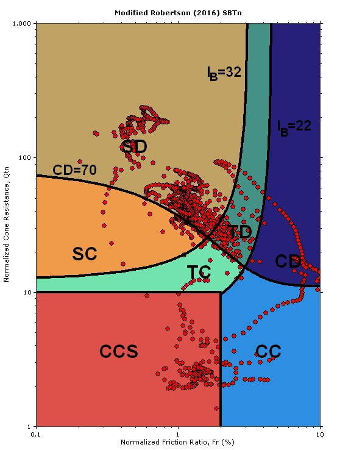
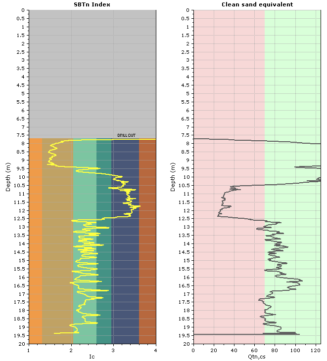
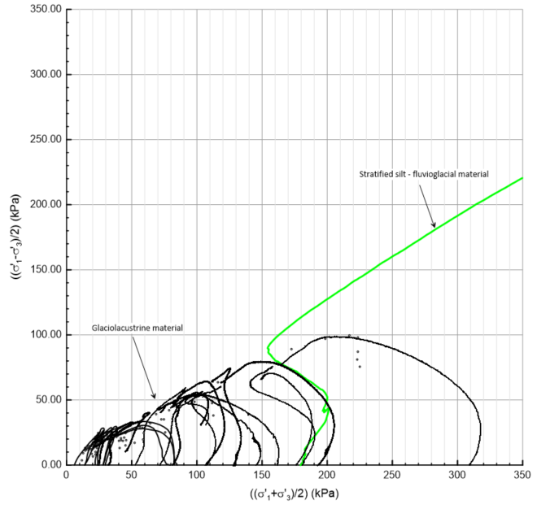
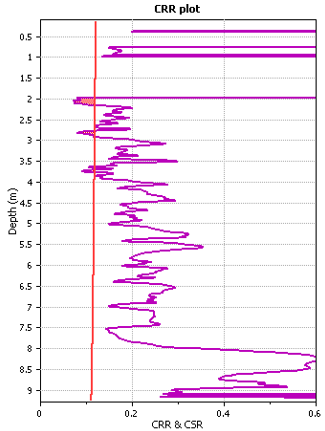
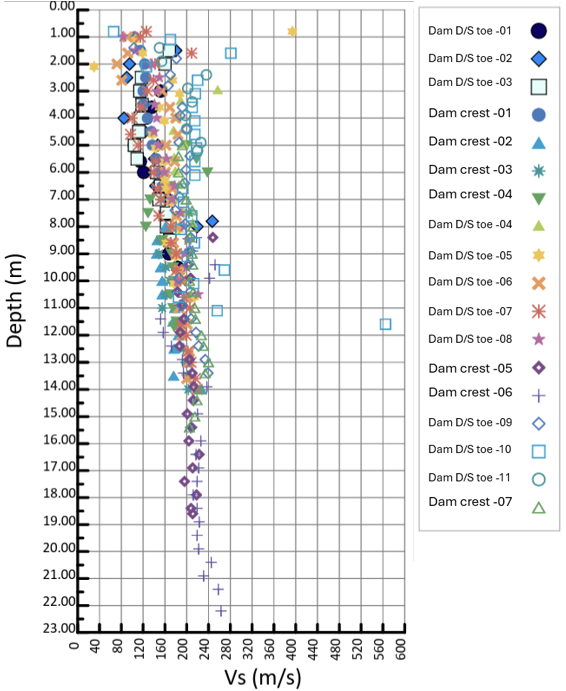

```{r}
#| include: false
library(here)
root <- normalizePath(here::here())
source(file.path(root, "scripts", "setup", "setup.R"))

TR_TARGET   <- 10000
IDg_TARGET  <- "S30"
IDm_TARGET  <- "U2"
ID_TARGET   <- "NBCC.max"
VS30_TARGET <- 560
DA_TARGET   <- c(0.5, 2.5, 5)
p_TARGET    <- "mean"
PSA_Units   <- "g"

source(file.path(root, "scripts", "example", "kmax.R"))
```

## ABSTRACT

This paper presents a performance-based seismic design framework for the preliminary dynamic stability assessment of embankments constructed on soft, sensitive foundations such as varved glaciolacustrine clay. Where regulations require reclaimed tailings impoundments to withstand the Maximum Credible Earthquake (MCE) without loss of containment, robust screening methods become essential—particularly when available geotechnical data are limited.

A core element of the framework is the probabilistic selection of the horizontal seismic coefficient $k_h$: hazard fractiles from a site-specific probabilistic seismic hazard analysis are propagated through a nonlinear site-amplification model and a logic-tree ensemble of empirical Newmark sliding-block models to yield quantile estimates of $k_{\max}$ at user-defined displacement thresholds.

By explicitly accounting for uncertainty in the seismic hazard and in the site-amplification response, the methodology delivers mean and quantile estimates of the seismic coefficient. Applied to a TSF embankment system `r SUMMARY$Hs` m deep to hard ground on glaciolacustrine foundation at $T_R = `r SUMMARY$trLabel`$ yr, the procedure yields $\bar{k}_{\max} = `r SUMMARY$DaRows[[2]]$kmaxMean`$ ($K_h = `r SUMMARY$DaRows[[2]]$khMean`\%$) at a target displacement of `r SUMMARY$DaRows[[2]]$Da` cm.

## RESUME

Cet article présente un cadre de conception sismique basé sur la performance pour l'évaluation préliminaire de la stabilité dynamique des digues construites sur des fondations molles et sensibles, telles que les argiles varvées glaciolacustres. Lorsque la réglementation exige que les parcs à résidus réhabilités résistent au séisme maximal crédible (SMC) sans perte de confinement, des méthodes de vérification robustes deviennent essentielles, en particulier lorsque les données géotechniques disponibles sont limitées.

Un élément central du cadre est la sélection probabiliste du coefficient sismique horizontal $k_h$ : les fractiles de l'aléa issus d'une analyse probabiliste de l'aléa sismique spécifique au site sont propagés à travers un modèle non linéaire d'amplification de site et un ensemble logique de modèles empiriques de déplacement de type Newmark, afin de produire des estimations quantiles de $k_{\max}$ pour des seuils de déplacement définis par l'utilisateur.

En tenant explicitement compte des incertitudes dans l'aléa sismique et dans la réponse d'amplification de site, la méthodologie fournit des estimations moyennes et quantiles du coefficient sismique. Appliquée à un système de digues de `r SUMMARY$Hs` m de profondeur jusqu'au sol dur, sur fondation glaciolacustre, pour $T_R = `r SUMMARY$trLabel`$ ans, la procédure donne $\bar{k}_{\max} = `r SUMMARY$DaRows[[2]]$kmaxMean`$ ($K_h = `r SUMMARY$DaRows[[2]]$khMean`\%$) pour un déplacement cible de `r SUMMARY$DaRows[[2]]$Da` cm.

## INTRODUCTION

The rewards of successful mineral exploration and development can be substantial when a deposit is discovered, evaluated, and ultimately brought into production. However, mine development is inherently risky and time‑consuming. It typically takes many years for a mining company to progress from early opportunity identification through to project execution and mine commissioning. Over this lifecycle, the development of a mining project and its associated infrastructure, such as the tailings storage facility (TSF) requires a series of technical and economic studies, beginning with general site characterization and progressing through multiple levels of economic evaluation. Social acceptability and environmental liability are among the key factors that must be addressed throughout this process.

Adopting a performance‑based design approach for the reclamation, development, and operation of a TSF provides a transparent and technically robust way to link seismic demand directly to clearly defined performance objectives (e.g., allowable deformations, loss‑of‑containment criteria). This approach moves beyond prescriptive factors of safety and allows engineers to "right‑size" designs: avoiding under‑design that could compromise safety, while also avoiding overly conservative embankments design that drive unnecessary capital and operating costs. Since performance criteria and risk tolerances are explicitly defined and quantified, performance‑based design can support faster and more defensible permitting, improve communication with regulators and communities, and enhance social acceptability and stakeholder appreciation and approval.

This is particularly important given that TSFs typically represent the longest‑lived asset and the most enduring liability for a mining company. While ore processing and active operations are finite in time, the tailings facility remains on site effectively in perpetuity, carrying long‑term geotechnical, environmental, and reputational risks. A performance‑based seismic design framework provides a rational basis for managing this long‑term liability by demonstrating, in quantifiable terms, that the facility can meet its required performance levels throughout its operational life and into closure and post‑closure.

As part of early stage of project, a performance‑based design methodology can be deployed. The performance of of an embankment can be defined against multiple objectives and criteria, through the used of a deterministic model. As emphasized by [@LacasseNadim1998], as more sounding, drilling and testing becomes available, a performance-based progress toward a probabilistic framework.

This paper presents the application of a performance‑based seismic design framework to evaluate the long‑term performance of a TSF and to inform the selection and refinement of the reclamation concept.

## performance‑based seismic design framework - Concept and vision

The geotechnical stability of embankments is most commonly evaluated using deterministic limit‑equilibrium analyses, in which a factor of safety (FoS) is computed for specified loading conditions and fixed input parameters describing loads and resistances.

By contrast to the resistance of geomaterials that is often poorly constrained, the distributions describing the main external loads—such as design seismic loads—can usually be defined at an early stage of a project and tend to evolve less as the project progresses [@LacasseNadim1998].

Likewise, performance criteria or performance objectives for TSFs are typically established early and, similar to the load definition, should not vary significantly throughout the engineering process.

In current practice, assessment of embankment safety often relies on verifying that the FoS under static and pseudo‑static (seismic) loading exceeds prescribed minimum values. The performance objectives and earthquake design criteria for TSFs is a function of consequence classification and, where applicable, project phase. Consequence classes are based primarily on population at risk, potential loss of life, and the scale of environmental and socio‑economic impacts. In all recommended frameworks, post‑closure conditions must satisfy the most stringent seismic criteria, with the desired annual probability of exceedance (AEP). In Québec, the prescribed post‑closure seismic criteria require TSFs to be designed either for an event with an annual exceedance probability (AEP) of 1/10 000 or for the Maximum Credible Earthquake (MCE), as defined in the [@MERN2024] guidelines. It must be demonstrated that the facility can withstand such events without catastrophic failure.

Demonstrating compliance with these seismic criteria depends critically on the choice of analysis method. Within this regulatory context, it is acknowledged that advanced equivalent‑linear or fully nonlinear dynamic finite‑element/finite‑difference (FE/FD) analyses are often difficult to justify for preliminary or screening‑level studies, given their data requirements, cost, and complexity. Consequently, at early project stages, the dynamic stability of TSF embankments is typically evaluated by comparing pseudo‑static factors of safety against prescribed criteria.

Typically, when target FoS for pseudo-static loading condition is not achieved, the standard response is to modify the geometry (e.g., flatten slopes, add buttresses) of embankment(s) or to recommend additional works or assessment(s). This approach frequently leads to conservative designs, higher capital and operating costs. This FoS‑centred methodology is inherently focused on "failure" as a binary outcome and tends to obscure the underlying question of what constitutes unacceptable performance. Therefore, Newmark displacement analyses are increasingly used as an alternative or complement to pseudo‑static stability assessment. They serve as a screening‑level tool to estimate the relative magnitude of permanent embankment displacements induced by seismic loading. For example, should an earthquake‑induced permanent deformation of 25 cm, 50 cm, or 100 cm for a given embankment be considered "failure," or could it represent acceptable performance within a performance‑based framework? Such
performance-based procedures, allows linking the seismic coefficient ($k_{h}$) to be used as part of the pseudo-static slope stability assessment to an explicit project-based displacement tolerance and a probabilistic seismic hazard as discussed below.

It is worth mentioning that U.S. Army Corps of Engineers (USACE) Engineer Manual EM 1110-2-1902 and EM 1110-2-2100 endorse pseudo-static stability analysis as one of several acceptable methods and addresses the Newmark sliding-block approach for estimating permanent seismic deformation and establishing the principle that $k_{h}$ must reflect project-specific conditions. As the USACE, the Canadian Dan Association (CDA), the Eurocode, the National Cooperative Highway Research Program (NCHRP) and the International Commission on Large Dams (ICOLD), endorse the Newmark displacement approach, with the same caveat: the $k_{h}$ must reflect project-specific conditions.

## Performance-Based Seismic Coefficient

As part of pseudo-static slope stability, the dynamic effect of earthquake shaking is simplified and represented as an equivalent static horizontal force. This force is proportional to a seismic coefficient, $k_{h}$, and the weight of the potential sliding mass. Historically, the value of $k_{h}$ has been selected either as a fixed fraction of the regional design peak ground acceleration (PGA) or based on engineering judgment.

Over the past decades, a transition toward performance-based procedures linking $k_{h}$ to an explicit project-based displacement tolerance and a probabilistic seismic hazard level reflecting the consequence class of the structure occured. This transition has been enabled by the development of empirical Newmark sliding-block displacement models (rigid-block and flexible-block formulations) translating ground-motion intensity into probability distributions of permanent residual displacement. This approach allows defining seismic design criteria in terms of quantified performance outcomes rather than nominal force levels [@USACECorpsEngineers2003; @AndersonEtAl2008].

The performance-based framework for pseudo-static seismic coefficient selection was established by [@BrayTravasarou2007; @BrayTravasarou2009]. The procedure enables direct determination of the design seismic coefficient required to limit the probability of exceeding a specified displacement threshold, given site ground-motion demand, yield acceleration, and slope properties. The framework was subsequently extended by [@BrayMacedo2017; @BrayMacedo2019; @BrayMacedo2023], [@MacedoEtAl2018] and [@MacedoEtAl2020].

Empirical Newmark sliding-block displacement models form the core of these procedures. The Newmark sliding-block method conceptualizes the seismically loaded slope as either a rigid or a flexible (compliant) block resting on an inclined frictional surface. When the driving acceleration component along the failure plane exceeds the yield acceleration $k_{y}g$, the block undergoes incremental downslope movement; relative motion ceases when the driving acceleration falls below this threshold. The total permanent displacement $D_N$ accumulates over all exceedance episodes throughout the duration of shaking, and is modelled as a lognormal random variable:

$$\ln d_N^{(i)} = \mu_{\ln D_N}^{(i)}(\mathbf{I},\, k_{y},\, T_{s},\, M_{w}) + z\,\sigma_{\ln D_N}^{(i)}$$ {#eq-newmark}

where $\mathbf{I}$ denotes the vector of ground-motion intensity measures specific to each model (e.g., $PGA$, spectral acceleration $S_{a}$ at a reference period, Arias intensity $AI$, or peak ground velocity $PGV$); $T_{s}$ is the fundamental period of the sliding mass; $M_{w}$ is the earthquake moment magnitude where included as a model predictor; $\mu_{\ln D_N}^{(i)}$ is the model-predicted mean log-displacement; $\sigma_{\ln D_N}^{(i)}$ is the associated standard deviation in natural-log space; and $z \sim \mathcal{N}(0,1)$ is a standard-normal variate capturing record-to-record variability not explained by the regression. Within the Monte Carlo loop a single draw $z^{(n)}$ is shared across all six models per realisation, as described below.

Rigid-block models treat the sliding mass as an undistorted body whose movement is driven entirely by the base excitation; dynamic amplification within the mass is negligible. This idealisation is appropriate for shallow translational failure surfaces in relatively stiff materials. Three rigid-block formulations are Ambraseys and Menu [-@AmbraseysMenu1988], Jibson [-@Jibson2007], and Saygili and Rathje [-@SaygiliRathje2008].

Flexible-block models account for the deformability of the sliding mass by incorporating its fundamental period $T_s$ and spectral acceleration $S_a$ evaluated at a shifted period $\alpha T_s$. These formulations include an explicit $M_w$ term and are appropriate for deeper-seated failure surfaces in earth dams, natural slopes, and waste embankments where the sliding mass has significant deformability. Three flexible-block formulations are Bray and Travasarou [-@BrayTravasarou2007], Bray, Macedo and Travasarou [-@BrayEtAl2018], and Bray and Macedo [-@BrayMacedo2019; -@BrayMacedo2023].

The performance-based framework reconceptualizes $k_{h}$ selection as an inverse problem: the design coefficient $k_{\max}$ is the minimum yield coefficient $k_{y} = a_{y}/g$ for which the probability of the Newmark displacement $D_N$ exceeding the allowable threshold $d^*$, integrated over the seismic hazard at return period $T_R$, is bounded at the target exceedance probability $p$:

$$k_{\max}(p \mid d^*, T_R) = \inf\!\bigl\{k_{y} : P\bigl[D_N(k_y) > d^* \mid T_R\bigr] \leq p\bigr\}$$ {#eq-kmaxDef}

$P[D_N(k_y) > d^* \mid T_R]$ has no closed form — the joint distribution of ground-motion intensities at rock level, the site-amplification factor, and the Newmark regression residual do not admit an analytical convolution. The probability is therefore evaluated numerically: the steps below describe a Monte Carlo loop over $N_S$ realisations drawn from each contributing distribution at $T_R$; the empirical distribution of $\{k_\text{max}^{(n)}(d^*)\}_{n=1}^{N_S}$ produced by that loop approximates the inverse mapping $d^* \mapsto k_\text{max}(p \mid d^*, T_R)$.

The empirical Newmark regressions described above carry intrinsic limitations as a basis for selecting the seismic coefficient of a critical structure. Each regression carries its own scatter $\sigma_{\ln D_N}$, the regressions can disagree with one another for the same input, and the regressions themselves provide no rule for choosing a single representative value. Furthermore, regression models alone do not propagate the variability of the regional hazard nor the uncertainty of the site response. Producing $k_h$ at a designer-chosen target exceedance probability $p$ requires integrating hazard, site-response, and regression-model variability into a single distribution — which is what the procedure of @Verri2026 does. The first parameter required is $T_s$, since the spectral periods needed from the PSHA depend on it.

$T_s$ is estimated from the shear stiffness profile of the embankment following the truncated shear-beam framework of Ambraseys [-@Ambraseys1960] and Gazetas [-@Gazetas1982], extended to include berm geometry by Dakoulas and Gazetas [-@DakoulasGazetas1985]. The small-strain shear modulus profile is established from the formulation of @Ishihara1996:

$$G(z,\,e_o) \approx A\,\frac{(C_e - 1)^2}{1 + e_o}\,\left(\frac{\sigma'_o(z)}{p_\text{ref}}\right)^n$$ {#eq-ishihara}

where $A$, $C_e$, and $n$ are determined from resonant column or bender element tests and tabulated by USCS classification; $\sigma'_o(z)$ is the octahedral effective stress at depth $z$. Evaluating at $z = H_\text{max}$, where $\sigma'_o$ reaches its maximum under self-weight, gives $G_o$ and the base shear-wave velocity $v_S^o = \sqrt{G_o/\rho}$. The homogeneity ratio $m_o$ is obtained by fitting $G(z)/G_o = (z/H_\text{max})^{m_o}$ to the measured or inferred stiffness data. The truncation ratio $\lambda_o = B_o/(2H_\text{max}s + B_o)$ captures the berm geometry. The fundamental period follows from @Gazetas1982 as:

$$T_s \simeq \frac{4\pi H_\text{max}}{a^{(1)}(2 - m_o)\,v_S^o}$$ {#eq-ts}

where $a^{(1)}$ is the first eigenvalue of the characteristic equation governing the laterally constrained embankment under harmonic base excitation, a function of $m_o$ and $\lambda_o$ tabulated in Dakoulas and Gazetas [-@DakoulasGazetas1985].

With $T_s$ determined, the required intensity-measure periods are fixed: $T^{(1)} = 0$ (PGA) for the rigid-block models and for the nonlinear site-amplification term, $1.5\,T_s$ for the flexible-block models of Bray and Travasarou [-@BrayTravasarou2007] and Bray and Macedo [-@BrayMacedo2017], and $1.3\,T_s$ for the updated model of Bray and Macedo [-@BrayMacedo2019]. The PSHA returns, at each required period $T^{(j)}$ and at the design return period $T_R$ for reference rock condition $V_{S30,\text{ref}}$, a discrete set of empirical fractiles $\{q^{(k)},\, S_a^{(k)}(T^{(j)})\}$. For each realisation $n$, a correlated standard-normal vector $\boldsymbol{u}^{(n)}$ is drawn by Cholesky decomposition of the inter-period correlation matrix $\mathbf{C}$ of Baker and Jayaram [-@BakerJayaram2008], with entries $C^{(j,m)} = \rho_\text{BJ}(T^{(j)}, T^{(m)})$:

$$\boldsymbol{u}^{(n)} = \mathbf{L}\,\boldsymbol{z}_c^{(n)}, \qquad \boldsymbol{z}_c^{(n)} \sim \mathcal{N}(\mathbf{0}, \mathbf{I}), \qquad \mathbf{L}\mathbf{L}^\top = \mathbf{C}.$$ {#eq-cholesky}

Each component $u^{(j,n)}$ of $\boldsymbol{u}^{(n)}$ is then mapped to a rock-level log-spectral ordinate via the period-specific PSHA quantile function $Q^{(j)}$, with $\Phi$ the standard normal CDF:

$$\ln S_a^{(n)}(T^{(j)}) = Q^{(j)}\!\bigl(\Phi(u^{(j,n)})\bigr).$$ {#eq-psha}

The rock-level intensities are then amplified to the target site. The amplification factor $F$ is lognormal with mean log-amplification $\mu_{\ln F}(T^{(j)}, V_{S30}, \mathrm{PGA}^{(n)}) = \ln F_{760}(T^{(j)}) + \ln F_V(V_{S30}, T^{(j)}) + \ln F_{nl}(V_{S30}, \mathrm{PGA}^{(n)}, T^{(j)})$ and total log-space dispersion $\sigma_{\ln F}^2 = \sigma_L^2 + \sigma_I^2 + \sigma_{NL}^2$ [@SeyhanStewart2014], where $\mathrm{PGA}^{(n)} = S_a^{(n)}(T^{(1)})$ is the realisation's own rock-level PGA so that the nonlinear term is internally consistent. An independent draw at each period gives the surface ordinate:

$$S_a^{(n)}(T^{(j)}, V_{S30}) = F^{(n)}(T^{(j)}) \cdot S_a^{(n)}(T^{(j)}, V_{S30,\text{ref}}), \qquad \ln F^{(n)}(T^{(j)}) \sim \mathcal{N}\!\bigl(\mu_{\ln F},\, \sigma_{\ln F}^2\bigr).$$ {#eq-site}

A single standard-normal residual $z^{(n)} \sim \mathcal{N}(0,1)$ is then drawn and shared across all models in the ensemble. For each grid point $k_y^{(k)}$ and each displacement model $(i)$, the per-realisation displacement sample is:

$$d_N^{(i,n,k)} = \exp\!\bigl[\mu_{\ln D_N}^{(i)}(k_y^{(k)},\, \mathbf{I}^{(n)}) + \sigma_{\ln D_N}^{(i)}\, z^{(n)}\bigr],$$ {#eq-dn}

where $I^{(n)} = (\mathrm{PGA}^{(n)},\, S_a^{(n)}(\alpha T_s),\,\ldots)$ collects the surface-level intensity measures for realisation $n$. The shared $z^{(n)}$ reflects the working assumption of perfect cross-model residual correlation [@Verri2026]. Before inversion, each per-model curve is right-cumulative-max projected to enforce physical monotonicity in $k_y$:

$$\tilde{d}_N^{(i,n,k)} = \max_{m\,\geq\,k}\; d_N^{(i,n,m)}.$$ {#eq-proj}

Let $k^*$ be the grid index such that $\tilde{d}_N^{(i,n,k^*)} \geq d^* > \tilde{d}_N^{(i,n,k^*+1)}$. Piecewise log-log linear interpolation of the monotone curve gives the per-model per-realisation yield coefficient:

$$k_\text{max}^{(i,n)}(d^*) = k_y^{(k^*)} \left(\frac{d^*}{\tilde{d}_N^{(i,n,k^*)}}\right)^{\!\beta^{(k^*)}}, \qquad \beta^{(k^*)} = \frac{\ln k_y^{(k^*+1)} - \ln k_y^{(k^*)}}{\ln \tilde{d}_N^{(i,n,k^*+1)} - \ln \tilde{d}_N^{(i,n,k^*)}}.$$ {#eq-inv}

The logic-tree-weighted mean in linear $k_y$-space is the per-realisation result:

$$k_\text{max}^{(n)}(d^*) = \sum_{(i)} w^{(i)}\, k_\text{max}^{(i,n)}(d^*).$$ {#eq-kmaxMean}

Repeating over $N_S$ realisations yields the empirical distribution of $\{k_\text{max}^{(n)}(d^*)\}_{n=1}^{N_S}$, from which the mean and the $p$-th quantile are:

$$\bar{k}_\text{max}(d^*) = \frac{1}{N_S}\sum_{n=1}^{N_S} k_\text{max}^{(n)}(d^*), \qquad k_\text{max}^{(p)}(d^*) = Q_p\!\bigl[\{k_\text{max}^{(n)}(d^*)\}_{n=1}^{N_S}\bigr].$$ {#eq-summary}

The $p$-th quantile $k_\text{max}^{(p)}$ is the answer to the inverse problem of F2: the smallest $k_y$ such that the estimated exceedance probability is bounded at $p$. The normalised coefficient $K_h = \bar{k}_\text{max}\,/\,\overline{\mathrm{PGA}}_\text{rock} \times 100\%$ expresses the design value as a percentage of the mean rock-level PGA at $T_R$.

## Numerical application

The methodology is applied to a tailings storage facility in southwestern Quebec, Canada, subject to post-closure seismic requirements under the @MERN2024 guidelines. The facility comprises a series of containment embankments constructed on proximal glaciolacustrine deposits of the Barlow–Ojibway clay complex, with the tallest segment reaching approximately 13 m above the foundation surface. The total depth of the sliding system to hard ground is `r SUMMARY$Hs` m — the height governing the shear-beam fundamental period $T_s$ — and the site fill is classified as `r SUMMARY$USCS` with $V_{S30} = `r SUMMARY$vs30`$ m/s. Post-closure compliance under @MERN2024 requires that the facility withstand seismic events with $T_R = `r SUMMARY$trLabel`$ yr without catastrophic failure.

The embankments are constructed of compacted sand and gravel with a geomembrane clay liner (GCL) on the upstream slopes. The operating water level maintains a permanent freeboard of 2.0 m; the downstream slopes are classified as "Significant" consequence class under CDA guidelines.

Beneath the glaciolacustrine clays, a stratified silt unit exhibits sand‑like or transitional behaviour and is predominantly dilative, as confirmed by isotropically consolidated undrained (ICU) triaxial tests on undisturbed 3-inch Osterberg samples (Figures 1–3). Shear‑wave velocities were measured with seismic piezocone soundings; the resulting $V_s$ profiles are presented in Figure 5.

{width="100%"}

**Figure 1** Modified Robertson (2016) SBTn chart from a CPTu performed beneath the dam crest

{width="100%"}

**Figure 2** Modified Robertson (2016) SBTn and clean sand equivalent profile for a CPTu performed beneath the dam crest

A screening‑level liquefaction assessment was conducted following @YoudEtAl2001, based on comparison of cyclic resistance ratio (CRR) and cyclic stress ratio (CSR), to confirm the suitability of pseudo‑static slope stability analyses [@MakdisiSeed1977]. The foundation soils are predominantly non‑liquefiable (Figure 4), supporting the use of pseudo‑static factor-of-safety analyses for the seismic stability assessment.

{width="100%"}

**Figure 3** Undrained triaxial test performed on the fluvioglacial material

{width="100%"}

**Figure 4** Example of a CRR vs CSR profile for a magnitude 7.0 earthquake

{width="100%"}

**Figure 5** Measured $V_s$ profiles across the site

Site-specific seismic hazard was evaluated in conformance with the @MERN2024 guidelines using the probabilistic hazard model underlying the National Building Code of Canada. The calculations are carried out with the `newmark` R package [@Verri2017], which implements the procedure of @Verri2026.

In this application, `r SUMMARY$ns` correlated realisations are drawn from the PSHA hazard fractiles. Rock-level spectral accelerations are amplified using the nonlinear site-amplification model of @SeyhanStewart2014. The logic-tree ensemble includes four empirical Newmark sliding-block displacement models — Ambraseys and Menu [-@AmbraseysMenu1988], Bray and Travasarou [-@BrayTravasarou2007], Saygili and Rathje [-@SaygiliRathje2008], and Bray and Macedo [-@BrayMacedo2019] — each assigned equal weight $w^{(i)} = 1/4$.

The sliding system spans `r SUMMARY$Hs` m from crest to hard ground (slope gradient $s = `r SUMMARY$slope`$, truncation ratio $\lambda_o = `r SUMMARY$lambdaO`$, berm `r SUMMARY$berm` m). Applying @eq-ishihara and @eq-ts gives $G_o = `r SUMMARY$goMin`$–$`r SUMMARY$goMax`$ MPa, $v_S^o = `r SUMMARY$vsoMin`$–$`r SUMMARY$vsoMax`$ m/s, and $T_s = `r SUMMARY$tsMin`$–$`r SUMMARY$tsMax`$ s (median $`r SUMMARY$tsMed`$ s), placing the flexible-block reference periods at $1.5\,T_s = `r SUMMARY$T15Ts`$ s and $1.3\,T_s = `r SUMMARY$T13Ts`$ s.

At $T_R = `r SUMMARY$trLabel`$ yr, the mean rock-level PGA (reference $V_{S30} = `r SUMMARY$vrockLabel`$ m/s) is $\overline{\mathrm{PGA}}_\text{rock} = `r SUMMARY$pga`$ g, with the 84th-percentile reaching $`r SUMMARY$pga84rock`$ g. The mean spectral accelerations at the flexible-block reference periods are $\bar{S}_{a,\text{rock}}(1.5\,T_s) = `r SUMMARY$sa15TsRock`$ g and $\bar{S}_{a,\text{rock}}(1.3\,T_s) = `r SUMMARY$sa13TsRock`$ g.

The ST17 model yields a mean amplification factor at PGA of $\bar{F}_\text{PGA} = `r SUMMARY$afPGA`$ ($\mu_{\ln F} = `r SUMMARY$muLnFpga`$, $\sigma_{\ln F} = `r SUMMARY$sigLnFpga`$); at the reference periods the amplification factors are $`r SUMMARY$af15Ts`$ and $`r SUMMARY$af13Ts`$, yielding site-level spectral accelerations $\bar{S}_{a,\text{site}}(1.5\,T_s) = `r SUMMARY$saF15Ts`$ g and $\bar{S}_{a,\text{site}}(1.3\,T_s) = `r SUMMARY$saF13Ts`$ g.

```{r}
#| label: tbl-kmax
#| tbl-cap: !expr paste0("$k_\\\\text{max}$ and $K_h$ at $T_R = ", SUMMARY$trLabel, "$ yr, $V_{S30} = ", SUMMARY$vs30, "$ m/s.")
DT_kmax <- data.table(
  `d* (cm)`    = sapply(SUMMARY$DaRows, `[[`, "Da"),
  `kmax (16%)` = sapply(SUMMARY$DaRows, `[[`, "kmax16"),
  `kmax (mean)`= sapply(SUMMARY$DaRows, `[[`, "kmaxMean"),
  `kmax (84%)` = sapply(SUMMARY$DaRows, `[[`, "kmax84"),
  `Kh 16% (%)`  = sapply(SUMMARY$DaRows, `[[`, "kh16"),
  `Kh mean (%)` = sapply(SUMMARY$DaRows, `[[`, "khMean"),
  `Kh 84% (%)`  = sapply(SUMMARY$DaRows, `[[`, "kh84")
)
knitr::kable(DT_kmax, align = "c")
```

For the intermediate displacement target $d^* = `r SUMMARY$DaRows[[2]]$Da`$ cm, the mean seismic coefficient $\bar{k}_\text{max} = `r SUMMARY$DaRows[[2]]$kmaxMean`$ and its 84th-percentile $k_\text{max}^{(84\%)} = `r SUMMARY$DaRows[[2]]$kmax84`$ jointly reflect the uncertainty propagated from the rock-level hazard fractiles through site amplification and the model ensemble; the corresponding normalised pseudostatic coefficient is $K_h = `r SUMMARY$DaRows[[2]]$khMean`\%$ of $\overline{\mathrm{PGA}}_\text{rock}$. The $k_{\max}$ values in @tbl-kmax were applied as the horizontal pseudo-static seismic coefficient in limit-equilibrium stability analyses of the embankment cross-sections, confirming that the embankments satisfy the @MERN2024 displacement criteria under the $T_R = `r SUMMARY$trLabel`$ yr design earthquake.

```{r}
#| include: false
rm(TR_TARGET, IDg_TARGET, IDm_TARGET, ID_TARGET, VS30_TARGET,
   DA_TARGET, p_TARGET, PSA_Units, SUMMARY, DT_kmax)
```

## Closing remarks

Acknowledging that the key seismic load parameters for a project typically change little once the controlling sources and design levels have been established, they should be defined as early as practicable in the engineering process. In parallel, clear, quantitative performance objectives (e.g., tolerable permanent displacements, no loss of containment) should also be set at the outset of any studies, assessment or trade-offs while looking to design for closure purpose. Having both the seismic demand and the performance objectives defined from the start greatly facilitates the implementation of a performance‑based approach for assessing TSF embankment long-term stability.

The methodology applied in this study provides a rational framework in which the seismic performance of the TSF embankments is evaluated in terms of earthquake‑induced permanent displacements, rather than solely through prescriptive FoS. By linking the horizontal seismic coefficient to a user-defined displacement threshold, the procedure delivers design values with explicit uncertainty bounds, providing a transparent basis for regulatory compliance under the design-level earthquake.

More broadly, introducing performance‑based principles early in a project allows the seismic load definition to be established, while the characterization of material resistance is progressively refined through additional site investigation and testing. As the statistical description of resistance improves, the probabilistic demand framework presented here can be combined with a statistical description of material resistance to support fully reliability‑based design, enabling more transparent, risk‑informed decisions for the long‑term stability of tailings storage facilities.

# References